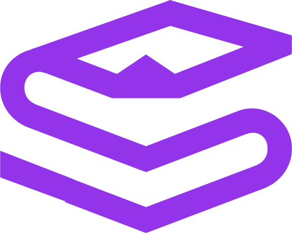

<div align="center">

<h1>StackUp UI</h1>
<p><b>StackUp UI</b> is a simple demo design system developed using <a href="https://stitches.dev/">Stitches</a>.</p>
<a href="https://github.com/wesleey/stackup-ui/blob/HEAD/LICENSE" target="blank"></a>
<a href="https://github.com/wesleey/stackup-ui/stargazers" target="blank"></a>
<a href="https://www.figma.com/file/8XTGoQm7DLfHxkEor5UciS/StackUp-UI---Design-System?node-id=0%3A1&t=unBIr5UR11tucVqV-1" target="blank"></a>
<a href="https://wesleey.github.io/stackup-ui" target="blank"></a>
</div>

## Installation

### React

**npm:**

```bash
npm i @stackup-ui/react
```

**yarn:**

```bash
yarn add @stackup-ui/react
```

## License

This project is licensed under the terms of the [MIT license](https://github.com/wesleey/stackup-ui/blob/HEAD/LICENSE).
